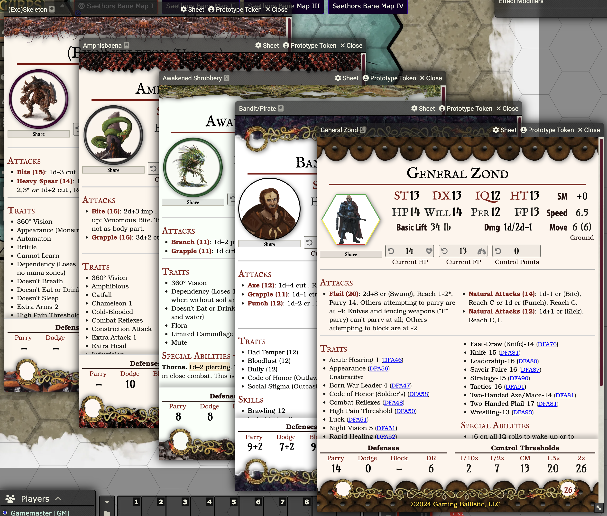

# GURPS Quick Reference Character Sheet

Latest release manifest can always be found here:

https://github.com/mjeffw/gurps-quick-reference-sheet/releases/download/latest/module.json

[Change log](./changelog.md)

The clean, compact, and beautiful GURPS character sheet created by Gaming Ballistic for Saethor's Bane for DFRPG module, as a standalone character sheet for any GURPS Game Aid (GGA) actor.

For more Dungeon Fantasy RPG (Powered by GURPS) material see [Gaming Ballistic](https://gaming-ballistic.myshopify.com/collections/all-products?filter.p.m.my_fields.collection=Dungeon+Fantasy+RPG+%28Powered+by+GURPS%29&sort_by=title-ascending).

Dungeon Fantasy RPG is copyright ©1980, 2018–2024 by Steve Jackson Games Incorporated. Dungeon Fantasy RPG, the pyramid logo, and the names of all products published by Steve Jackson Games Incorporated are trademarks or registered trademarks of Steve Jackson Games Incorporated, and used under license. All rights reserved.

GURPS is a trademark of Steve Jackson Games, and its rules and art are copyrighted by Steve Jackson Games. All rights are reserved by Steve Jackson Games. This game aid is the original creation of M. Jeff Wilson and is released for free distribution, and not for resale, under the permissions granted in the[Steve Jackson Games Online Policy](http://www.sjgames.com/general/online_policy.html).

*The scanning, uploading, and distribution of this material via the Internet or via any other means without the permission of the publisher is illegal, and punishable by law. Please purchase only authorized electronic editions, and do not participate in or encourage the electronic piracy of copyrighted materials. Your support of the authors’ rights is appreciated.*